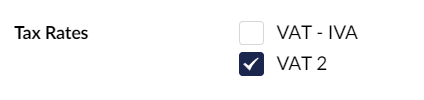

# Tax Rates Property Editor

The Tax Rates property editor allows you to assign a [TaxRate](../../object-reference/taxrate.md) to a product which is used to calculate owed tax during the checkout

<figure><figcaption></figcaption></figure>
