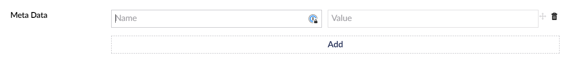

# Meta Data Property Editor

The Meta Data property editor allows you to add `Dictionary<string, string>` to your product, this is passed over to the Payment Provider.

<figure><figcaption></figcaption></figure>
